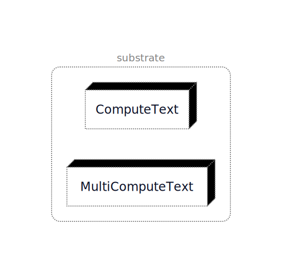

# Generate text with an LLM

<details>
    <summary>How to run this example</summary>
    
```bash
# Set your API key as an environment variable.
export SUBSTRATE_API_KEY=ENTER_YOUR_KEY

# Run the TypeScript example
cd typescript                   # Navigate to the typescript example
npm install                     # Install dependencies
ts-node example.ts              # Run the ComputeText example
ts-node example-multi.ts        # Run the MultiComputeText example

# Run the Python example
# Note: First install dependencies in the root examples directory.
cd python                       # Navigate to the python example
poetry install                  # Install dependencies and build the example
poetry run example              # Run the ComputeText example
poetry run example-multi        # Run the MultiComputeText example
```

</details>


To generate text with an LLM, use [`ComputeText`](https://www.substrate.run/nodes#ComputeText).

```python Python
# example.py
from substrate import Substrate, ComputeText

substrate = Substrate(api_key="YOUR_API_KEY")

story = ComputeText(prompt="tell me a short 2-sentence story")
res = substrate.run(story)

print(res.get(story).text)
```

```typescript TypeScript
// example.ts
import { Substrate, ComputeText } from "substrate";

const substrate = new Substrate({ apiKey: "YOUR_API_KEY" });

const story = new ComputeText({ prompt: "tell me a short 2-sentence story" });
const res = await substrate.run(story);

console.log(res.get(story).text);
```

Sometimes, we want the LLM to generate multiple choices so that we can choose the best result. To generate multiple text choices, use [`MultiComputeText`](https://www.substrate.run/nodes#MultiComputeText).

```python Python
# example-multi.py
from substrate import Substrate, MultiComputeText

story = MultiComputeText(
    prompt="tell me a short 2-sentence story",
    num_choices=2,
)

res = substrate.run(story)

print("1:", res.get(story).choices[0].text)
print("2:", res.get(story).choices[1].text)
```

```typescript TypeScript
// example-multi.ts
import { Substrate, MultiComputeText } from "substrate";

const story = new MultiComputeText({
  prompt: "tell me a short 2-sentence story",
  num_choices: 2,
});

const res = await substrate.run(story);

console.log("1:", res.get(story).choices[0].text);
console.log("2:", res.get(story).choices[1].text);
```

The output of `MultiComputeText` contains an array of `choices`. If you run this example, you'll see something like this:

```bash
1: As the last rays of sunlight faded from the horizon, a lone violinist stood on the edge of the cliff, her music echoing across the deserted beach as the waves crashed against the shore below. The melody seemed to capture the essence of the fleeting moment, a symphony of freedom and solitude that would soon be lost in the darkness of night.
2: As the last rays of sunlight faded from the horizon, a lone violinist stood on the edge of the ocean, her music dancing across the waves as the stars began to twinkle in the night sky. The melody seemed to capture the essence of the sea itself, a haunting serenade that echoed through the darkness, a symphony of solitude and beauty.
```


